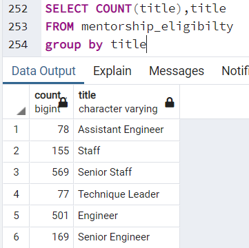
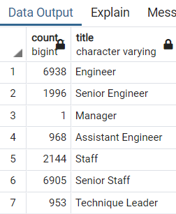

# Pewlett-Hackard-Analysis
## The Purpose
Pewlett-Hackard is a large company boasting several thousand employees and it’s been around for long time. As baby boomers begin to retire at a rapid rate Pewlett-Hackard is looking toward the future in two ways. It’s starting to think about which positions will need to be filled in the near future.
Bobby is an up-and-coming HR Analyst whose task is to perform employee research and Bobby’s manager has given us a job to determine the number of retiring employees per title, and to identify employees who are eligible to participate in a mentorship program. The Task is to help Bobby build an employee database with SQL by applying data modelling, engineering and analysis.
## Results
### The table of retiriment employees

This table shows an aprox of 133776 employees.
The problem with this table is that some empoyees are showing 2 times because they change positions over the years
### Unique Titles

 On this table, we use Dictinct to remove duplicate rows
 The table shows the exact 72458 people that are going to retire with no dupicates
### Retiring titles

this table shows employees titles and how many employess are based on their titles
### Mentorship program

we can see that 1549 employees are eligible for this program based on the date of birth between 01/01/65 to 12/31/65.
That seems to low to be able to train 72458 new employees in 4 years.

## SUMMARY
#### How many roles will need to be filled as the "silver tsunami" begins to make an impact?
#### Are there enough qualified, retirement-ready employees in the departments to mentor the next generation of Pewlett Hackard employees?
The employees expected to retire are a total of 72,458 at Pewlett Hackard. Those roles needs to be filled as employees retire. 
### This table shows how many people participate in a mentorship program and their titles

Employees who are eligible to participate in a mentorship program  are 1549 from the year of 1965. That means that each member needs to train areound 46-47 people in 4 years. which is 11-12 people a year and 1 each month which is impossible. I would say that maximun to train is 1-2 people per year to be able to have quality new employees. 
For that reason I will recommend the mentorship program to be exteded a few years between 1964-1965.
After  that we see that 19 905 employees will be able to train 72,458 new employees in 4 years. That is a better option 
### This table is mentorship extended between 1964-1965

