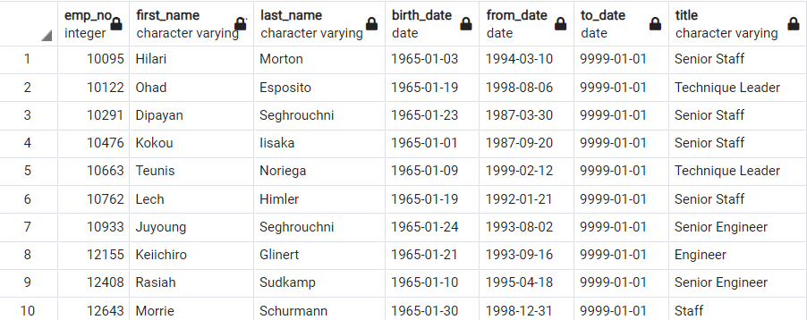

# Pewlett-Hackard-Analysis
## The Purpose
Ph is a large company boasting several thousand employees and it’s been around for long time. As baby boomers begin to retire at a rapid rate PH is looking toward the future in two ways. First, it’s offering retirement package for those who meet certain criteria. Second, it’s starting to think about which positions will need to be filled in the near future. 
Bobby is an up-and-coming HR Analyst whose task is to perform employee research and Bobby’s manager has given us a job to determine the number of retiring employees per title, and to identify employees who are eligible to participate in a mentorship program. The Task is to help Bobby build an employee database with SQL by applying data modelling, engineering and analysis.
## Results

## SUMMARY
